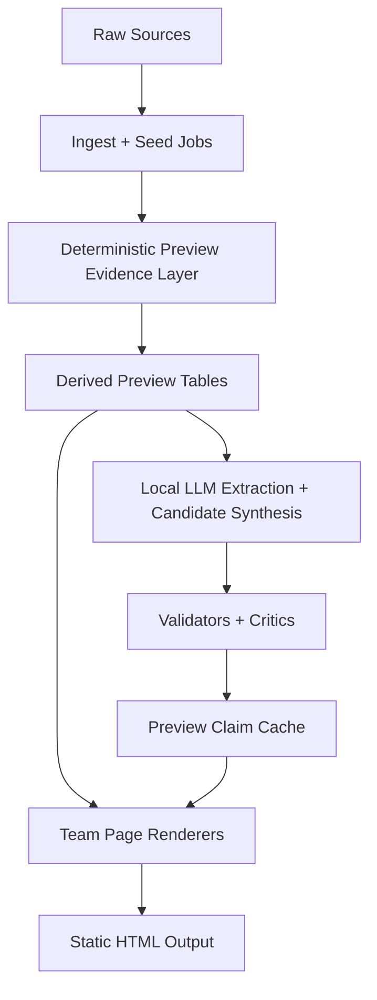

# Team Preview Implementation Plan

Date: 2026-05-26  
Target as-of frame: May 25, 2026  
Primary goal: make every team page feel like a forward-looking 2026 season preview, not a decorated 2025 recap  
Companion audit: `docs/audits/team-preview-repo-local-llm-audit-2026-05-26.md`

## 1. Product North Star

When a college football fan lands on a team page in late May 2026, the first experience should answer:

- What does this team look like heading into August?
- What changed since last season ended?
- What is the plausible floor, base, and ceiling once conference title games, bowls, and the CFP are included?
- Where is the roster better, thinner, or merely different?
- What are fans, media, models, and source signals arguing about?
- What is real, what is speculative, and what is unknown?

The page should delight two users at once:

- Casual fans get a clean season-path thesis, records, dates, and simple roster story.
- Diehards get the receipts: transfer position flow, returning production, draft loss, schedule leverage, model priors, fan-intel, citations, and confidence labels.

The plan below treats data truth as the first-class product. Prose and design sit on top of it.

## 2. Guiding Principles

1. Deterministic facts first.
   LLMs can synthesize, classify, and draft. They cannot be the source of truth for records, schedules, playoff paths, all-time bowl ledgers, player movement, or rankings.

2. Preview posture must be explicit.
   Every module should know whether it is preview, live-season, postseason, or historical. In May 2026, the default posture is `2026 preview`.

3. Roster reload is multi-source.
   Recruiting reload, transfer additions, transfer losses, draft departures, graduation/eligibility loss, and returning production are separate signals.

4. Floor/base/ceiling is final-season-aware.
   It must account for 12 regular-season games plus possible conference title games, bowl games, and CFP games.

5. All-time means all-time.
   If a data source is only CFBD-era or local-era, the label must say so.

6. Fan-intel renders only when sample quality supports it.
   A quiet program gets an honest "awaiting signal" state, not invented heat.

7. Local LLMs are maximized below the waterline.
   Use local models for extraction, classification, clustering, candidate generation, and critic prefilters. Use evidence-gated synthesis for public prose.

8. The design should feel native to the existing team-page system.
   Keep the three-act architecture, compact modules, receipt labels, and confidence signaling. Do not create a new landing-page style inside team pages.

## 3. Target Architecture

Raw sources already include CFBD, local game/rating/player tables, recruiting, transfer portal, draft, Chronicle visuals, source adapters, fan-intel seeds, and authored profiles.

The missing center is the deterministic preview evidence layer. That is the first implementation milestone.

## 4. Phase Overview

### Phase 0 - Guardrails and Canaries

Goal: make sure the implementation changes are testable before broad rollout.

Deliverables:

- Choose canary teams that stress different cases.
- Add a preview readiness audit command.
- Add a canonical real-FBS team filter.
- Confirm build/render commands for team-page-only iteration.

Suggested canaries:

- Alabama: CFP/title ceiling, high transfer/draft/recruiting complexity.
- Georgia: elite continuity and title expectation.
- Akron: low-ceiling MAC case where bowl/playoff assumptions must not inflate.
- Vanderbilt: high-story, non-traditional SEC case.
- UMass: low-signal/schedule/fan-intel fallback case.
- Notre Dame: independent schedule and CFP path without conference title game.
- Oregon or USC: Big Ten transfer/reload/schedule brand case.
- UConn: independent or low-fan-intel edge case.

Repo work:

- Add `python manage.py audit-team-preview-readiness --season 2026 --as-of 2026-05-25`.
- Audit output should count missing schedule, missing all-time bowl record, missing transfer snapshot, missing returning production, missing fan-intel, and fallback-only modules.
- Use the command in local validation before changing page rendering.

Acceptance:

- Readiness command runs on the canary set and all profiled teams.
- It clearly distinguishes "missing data" from "data present but low confidence".
- It does not treat `teams.level_code='FBS'` as authoritative without cleanup.

### Phase 1 - Data Contracts and Migrations

Goal: create durable tables that every renderer can consume.

Use the existing SQL migration flow:

- Add SQL under `migrations/`.
- Let `apply_sql_migrations` track files in `schema_migrations`.
- Keep tables appendable or upsertable.
- Index by `team_id`, `season_year`, `as_of_date`, and active/current flags.

Recommended migration group:

- `20260602_01_team_preview_core.sql`
- `20260602_02_team_preview_roster_reload.sql`
- `20260602_03_team_preview_bowl_ledger.sql`
- `20260602_04_team_preview_claim_cache.sql`

The exact date prefix can be adjusted to avoid collisions, but keep the split by concern.

#### 1.1 `team_preview_snapshot`

One row per team, season, and as-of date.

Purpose: central deterministic fact bundle for renderers.

Key fields:

- `team_id`
- `slug`
- `season_year`
- `as_of_date`
- `snapshot_kind` such as `offseason`, `preseason`, `live`
- `prior_season_year`
- `prior_wins`
- `prior_losses`
- `prior_ties`
- `prior_final_ap_rank`
- `prior_final_coaches_rank`
- `prior_final_cfp_rank`
- `conference_id`
- `conference_name`
- `schedule_known`
- `first_game_id`
- `first_game_start_utc`
- `first_game_opponent_id`
- `first_game_opponent_name`
- `power_prior_rating`
- `resume_prior_rating`
- `talent_rank`
- `talent_score`
- `recruiting_rank`
- `recruiting_score`
- `returning_total`
- `returning_offense`
- `returning_defense`
- `returning_qb`
- `returning_ol`
- `transfer_in_count`
- `transfer_out_count`
- `transfer_net_count`
- `drafted_count`
- `draft_capital_lost`
- `confidence_band`
- `missing_sources_json`
- `source_fingerprint`
- `created_at_utc`
- `updated_at_utc`

#### 1.2 `team_season_path_projection`

One row per team, season, as-of date, and scenario.

Purpose: replace `ceiling_floor.py` with final-season-aware records.

Fields:

- `team_id`
- `season_year`
- `as_of_date`
- `scenario` in `floor`, `base`, `ceiling`
- `regular_season_wins`
- `regular_season_losses`
- `conference_title_game` boolean
- `conference_title_result` in `win`, `loss`, `none`
- `bowl_or_cfp_path` in `none`, `bowl`, `cfp_first_round`, `cfp_quarterfinal`, `cfp_semifinal`, `cfp_title`, `national_champion`
- `postseason_wins`
- `postseason_losses`
- `final_wins`
- `final_losses`
- `final_ties`
- `path_label`
- `rationale`
- `model_version`
- `confidence_band`
- `source_fingerprint`
- `created_at_utc`

Example rendering:

- Alabama ceiling: `15-1`, "12-0 regular season, SEC title win, CFP title path with one postseason loss assumption removed if champion path is undefeated."
- Alabama base: maybe `11-2` or `12-2`, depending model.
- Akron base: maybe `4-8` or `5-7`, with no bowl path unless bowl eligibility is projected.

Important: the path math must be internally consistent. A `national_champion` scenario cannot include an unexplained CFP loss. A `cfp_title` scenario can be a title-game loss. A conference title game loss adds one loss and may still allow a CFP path for top teams.

#### 1.3 `team_transfer_position_snapshot`

One row per team, season, as-of date, and position.

Purpose: separate additions from losses, and separate count from quality.

Fields:

- `team_id`
- `season_year`
- `as_of_date`
- `position`
- `incoming_count`
- `incoming_avg_points`
- `incoming_total_points`
- `incoming_top_player_name`
- `incoming_top_player_rating`
- `outgoing_count`
- `outgoing_avg_points`
- `outgoing_total_points`
- `outgoing_top_player_name`
- `outgoing_top_player_rating`
- `net_count`
- `net_points`
- `production_lost`
- `production_added`
- `starter_risk_flag`
- `need_filled_flag`
- `confidence_band`

#### 1.4 `team_roster_reload_snapshot`

One row per team, season, and as-of date.

Purpose: headline roster story and module summary.

Fields:

- `team_id`
- `season_year`
- `as_of_date`
- `returning_profile_label`
- `transfer_profile_label`
- `draft_loss_label`
- `recruiting_reload_label`
- `primary_pressure_position`
- `primary_repair_position`
- `reload_score`
- `continuity_score`
- `volatility_score`
- `portal_addition_score`
- `portal_loss_score`
- `draft_loss_score`
- `freshman_injection_score`
- `summary_json`
- `confidence_band`
- `created_at_utc`

#### 1.5 `team_bowl_record_ledger`

One row per team and source version.

Purpose: true all-time bowl record.

Fields:

- `team_id`
- `slug`
- `wins`
- `losses`
- `ties`
- `appearances`
- `first_bowl_year`
- `last_bowl_year`
- `last_bowl_name`
- `last_bowl_result`
- `source_name`
- `source_url`
- `source_retrieved_at`
- `verification_status` in `verified`, `single_source`, `conflict`, `missing`
- `notes_json`
- `created_at_utc`
- `updated_at_utc`

Render rule:

- If `verification_status in ('verified', 'single_source')`, label as all-time bowl record with source marker.
- If absent, keep old module but label it "recent postseason record" or suppress it.

#### 1.6 `team_preview_claim_cache`

Purpose: store evidence-backed preview thesis snippets. This is not a source of truth; it is a cache of prose tied to deterministic evidence.

Fields:

- `claim_key`
- `team_id`
- `slug`
- `season_year`
- `as_of_date`
- `surface`
- `claim_type`
- `claim_text`
- `evidence_json`
- `evidence_hash`
- `prompt_template_id`
- `model_id`
- `model_backend`
- `voice_score`
- `fact_score`
- `slop_score`
- `confidence_band`
- `approved`
- `is_lkg`
- `created_at_utc`
- `superseded_at_utc`

This mirrors Chronicle cache patterns without mixing preview claims into generic Chronicle card rows.

### Phase 2 - Deterministic Builders

Goal: fill the new tables without LLM dependency.

Create a new package:

- `src/cfb_rankings/team_preview/__init__.py`
- `src/cfb_rankings/team_preview/evidence.py`
- `src/cfb_rankings/team_preview/schedule.py`
- `src/cfb_rankings/team_preview/season_path.py`
- `src/cfb_rankings/team_preview/roster_reload.py`
- `src/cfb_rankings/team_preview/bowl_ledger.py`
- `src/cfb_rankings/team_preview/readiness.py`
- `src/cfb_rankings/team_preview/persistence.py`

Add CLI commands:

- `python manage.py build-team-preview-snapshots --season 2026 --as-of 2026-05-25`
- `python manage.py compute-season-path-projections --season 2026 --as-of 2026-05-25`
- `python manage.py build-roster-reload-snapshots --season 2026 --as-of 2026-05-25`
- `python manage.py import-bowl-record-ledger --source <path-or-url> --as-of 2026-05-25`
- `python manage.py audit-team-preview-readiness --season 2026 --as-of 2026-05-25`

#### 2.1 Schedule Truth

Fix or bypass the current `cfb_calendar.kickoff_date` query mismatch.

Implementation:

- Prefer schedule from local `games` where `season_year=2026`, team participates, and `start_time_utc` is present.
- If no 2026 schedule is loaded, show a clear state: "2026 schedule not loaded" or "Week 1 window".
- Do not render a generic Aug. 30 countdown as if it is official.
- Add `schedule_known` to `team_preview_snapshot`.

Later enhancement:

- Add future schedule ingest if CFBD schedule endpoint is not currently loaded by preseason ingest.

#### 2.2 Season Path Projection

Build a deterministic projection engine. The MVP does not need to be a perfect betting model; it needs to be honest, consistent, and better than last-year variance.

Inputs:

- power prior
- returning production
- talent composite
- recruiting class
- transfer position score
- draft loss score
- schedule difficulty if known
- conference/independent status
- prior season record/rank
- program tier

MVP algorithm:

1. Build a team-strength prior.
2. Estimate regular-season win band.
3. Determine whether a conference title path is plausible.
4. Determine whether CFP/bowl path is plausible.
5. Produce floor/base/ceiling final records.
6. Attach assumption text and confidence.

Rules:

- Lower-tier or low-projection teams do not get bowl/CFP path unless the regular-season projection supports it.
- Independents cannot get a conference title game.
- Playoff-eligible ceiling paths can include up to four CFP games depending 12-team format and bye assumptions.
- If format/rule uncertainty exists, store that uncertainty in rationale and confidence.

Do not hard-code Alabama's `15-1`. The system should derive that such a ceiling is plausible only for elite teams.

#### 2.3 Roster Reload

Reuse the logic already proven in Chronicle visual queries, but write the result to first-class preview tables.

Inputs:

- `transfer_entries`
- `returning_production`
- `player_nfl_draft`
- `player_season_stats`
- `player_recruiting_profiles`
- `recruiting_entries`
- rosters when available

Output:

- position-level transfer additions/losses
- team-level reload summary
- draft-loss pressure
- freshman injection estimate
- continuity score
- volatility score

Key distinction:

- Transfer portal additions answer "who did they add now?"
- Transfer portal losses answer "what did the roster lose now?"
- Recruiting reload answers "what talent is entering the pipeline?"
- Returning production answers "what does not need replacing?"
- Draft/graduation answers "what proven production left?"

#### 2.4 Bowl Ledger

Implement in two layers:

1. Import table for true all-time bowl records.
2. Renderer fallback for missing/uncertain records.

Source hierarchy:

- team media guide or official athletics record book where available
- NCAA/recognized record source where available
- Sports-Reference or equivalent structured historical source
- Wikipedia only as a cross-check or fallback, not sole source for high-confidence blue blood pages

Implementation shape:

- Put source imports under `src/cfb_rankings/ingest/sources/bowl_records.py`.
- Use an input CSV/JSON seed for first pass if automated scraping is slower than needed.
- Store conflicts in `notes_json`.
- Add a readiness warning for missing all-time ledgers.

#### 2.5 Fan-Intel Activation

Before adding new fan UI, repair the data path:

- run `seed-source-registry`
- run `seed-priority-teams`
- run `seed-source-instances`
- run `seed-feed-instances`
- verify `priority_teams` is nonzero
- populate `conversation_document_targets`
- fix May 2026 offseason week mapping
- rerun cohort/mood jobs

Then add a deterministic fan-intel readiness object:

- sample count
- source diversity count
- last observed date
- dominant fan themes
- confidence
- suppress reason when missing

The UI can then render:

- "Fan Reality Gap"
- "What fans are arguing about"
- "Quiet board / low signal"

Only render claims when thresholds are met.

### Phase 3 - Team-Page Renderer Modules

Goal: rebuild the top of the page around the 2026 path.

Add modules:

- `src/cfb_rankings/team_pages/preview_thesis.py`
- `src/cfb_rankings/team_pages/season_path_band.py`
- `src/cfb_rankings/team_pages/roster_reload.py`
- `src/cfb_rankings/team_pages/transfer_balance.py`
- `src/cfb_rankings/team_pages/schedule_leverage.py`
- `src/cfb_rankings/team_pages/fan_reality_gap.py`

Modify:

- `src/cfb_rankings/team_pages/renderer.py`
- `src/cfb_rankings/team_pages/kickoff_countdown.py`
- `src/cfb_rankings/team_pages/bowl_history.py`
- `src/cfb_rankings/team_pages/ceiling_floor.py`
- `src/cfb_rankings/team_pages/offseason_pulse.py`
- `src/cfb_rankings/team_pages/top_players.py`

#### 3.1 New Act I

Rename Act I from "The 2026 Outlook" to "The 2026 Path" or keep "The 2026 Outlook" but change the internal modules.

Recommended order:

1. Preview Thesis
2. Season Path Band
3. Reload Dashboard
4. Schedule Leverage
5. Fan Reality Gap or Quiet Signal

Then show HS recruiting and portal-specific modules.

#### 3.2 Preview Thesis

Inputs:

- `team_preview_snapshot`
- `team_roster_reload_snapshot`
- `team_season_path_projection`
- optional `team_preview_claim_cache`

Render:

- one sentence
- three evidence chips
- confidence label
- source posture

Fallback:

- deterministic template from data if no approved LLM claim exists.

#### 3.3 Season Path Band

Replacement for `ceiling_floor.py`.

Render:

- three columns: Floor, Base, Ceiling
- each column shows final record first
- beneath it: regular season, conference title, postseason path
- confidence/rationale on hover or small subcopy

Example structure:

- Floor: `8-4`, "no CCG, bowl toss-up"
- Base: `11-2`, "SEC title mix, CFP at-large path"
- Ceiling: `15-1`, "SEC title + CFP title path"

The exact numbers come from data, not copy.

#### 3.4 Roster Reload Dashboard

Render four lanes:

- Returning Production
- Transfer Portal In
- Transfer Portal Out
- Draft/Graduation Loss
- Recruiting Reload

This can be dense. Use compact cells, position chips, and one clear "pressure point" label.

Design:

- not nested cards
- no giant prose block
- mobile collapses into horizontal lanes or stacked rows
- position abbreviations are acceptable for diehards, with accessible labels

#### 3.5 Transfer Balance

This can replace or refine the current portal cell in Offseason Pulse.

Render:

- position rows
- in count/quality
- out count/quality
- net pressure
- top addition/loss if known

This directly satisfies the user's requirement that transfer additions and losses be central, not buried inside recruiting reload.

#### 3.6 Schedule Leverage

Inputs:

- known 2026 schedule
- opponent power priors if available
- rivalry game dates
- travel/home/bye windows

Render:

- first game
- swing stretch
- hardest projected game
- trap or pressure spot if evidence supports it

Fallback:

- if schedule missing, render "schedule not loaded" with conference/Week 1 window rather than fake specifics.

#### 3.7 Fan Reality Gap

Inputs:

- fan-intel readiness object
- cohort divergence
- mood/fanbase signals
- source observations

Render when ready:

- fans expect
- models imply
- gap label
- evidence/samples

Fallback:

- "Signal not yet dense enough" state.

### Phase 4 - Local LLM Strategy

Goal: maximize local LLMs without letting them invent facts.

Use local LLMs for:

- source extraction to JSON
- fan-source tagging
- team/player/entity disambiguation
- transfer storyline candidate labels
- camp question clustering
- preview thesis candidates
- low-risk long-tail summaries
- slop and voice prefiltering

Do not use local LLMs as sole authority for:

- all-time records
- kickoff dates
- schedule dates
- player eligibility
- playoff format math
- final top-team public thesis without validator pass

#### 4.1 Preferred Runtime

Use `src/cfb_rankings/chronicle/runtime.py` as the preferred local-LLM foundation for new preview work.

Reasons:

- already supports Ollama
- already supports llama-server if installed
- has router/fallback architecture
- supports structured output
- fits Chronicle critic/evidence style

Avoid expanding direct usage of `llm_local.py` for public prose until its auto-pass validator behavior is removed or wrapped.

#### 4.2 Preview LLM Package

Add:

- `src/cfb_rankings/team_preview/llm_synthesis.py`
- `src/cfb_rankings/team_preview/prompts.py`
- `src/cfb_rankings/team_preview/validators.py`

Responsibilities:

- build evidence blocks from deterministic rows
- ask local model for structured candidate only
- run schema validation
- run numeric claim verifier
- run source support verifier
- run voice/slop checks
- write approved rows to `team_preview_claim_cache`

Suggested command:

- `python manage.py generate-team-preview-claims --season 2026 --as-of 2026-05-25 --backend local --tier longtail`

Suggested tiering:

- Long-tail teams: local-first, deterministic fallback.
- Mid-tier teams: local candidate plus validator; cloud only if local fails and page has enough data.
- Top-tier teams: local candidate for outline, Anthropic batch for final synthesis when needed, same validators.

#### 4.3 Usage Logging

Every LLM call, local or cloud, should log:

- model backend
- model id
- prompt template id
- schema version
- surface
- latency
- success/failure
- validator scores
- evidence hash

Use or extend `llm_usage_log`; do not create an invisible local-only path.

#### 4.4 Local Environment Checks

Add a health command:

- `python manage.py local-llm-status`

Checks:

- Ollama reachable
- configured writer/planner models present
- optional llama-server reachable
- `.env` variables loaded or absent
- small JSON schema test passes

This makes local LLM usage operational instead of fragile.

### Phase 5 - Design Integration

Goal: make the new preview system look like it belongs on the existing page, but more useful.

CSS files:

- `src/cfb_rankings/team_pages/assets/styles.css`
- `src/cfb_rankings/team_pages/assets/tokens.css`

Design constraints:

- compact, scan-first layout
- cards only for real modules, not decorative nesting
- 8px radius max unless existing token differs
- no oversized hero marketing section
- no one-note palette shift
- confidence/source labels visible but quiet
- mobile first-pass must not overflow text

Recommended visual treatments:

- Season Path Band: three stable columns, final record large, path segments below.
- Reload Dashboard: row-based matrix with position chips and small bars.
- Transfer Balance: tile mosaic or table-like compact rows, reusing Chronicle visual vocabulary.
- Schedule Leverage: small timeline or four-chip band.
- Fan Reality Gap: two-sided tension meter only when data is real.

Use existing Chronicle visual families where possible:

- `roster_replacement_grid`
- `returning_production_xray`
- `continuity_stress_test`
- `draft_pipeline_conveyor`

But move from cached SVG novelty to first-class preview modules when the data is important enough.

### Phase 6 - Tests and Verification

Add unit tests:

- `tests/test_team_preview_season_path.py`
- `tests/test_team_preview_roster_reload.py`
- `tests/test_team_preview_bowl_ledger.py`
- `tests/test_team_preview_schedule.py`
- `tests/test_team_preview_llm_validators.py`

Core test cases:

- Alabama-style elite team can project beyond 12 games.
- Akron-style low-projection team does not get fake bowl/CFP path.
- Notre Dame-style independent never gets conference title game.
- Missing future schedule produces honest fallback.
- Bowl module does not say all-time without all-time ledger.
- Transfer outflow and inflow remain separate.
- Local LLM JSON parse failure falls back to deterministic copy.
- Local LLM numeric claim that contradicts evidence is rejected.

Add integration tests:

- fixture DB with three teams and minimal tables
- run preview snapshot builder
- render canary pages
- assert key strings and `data-confidence` attributes

Add visual/browser QA:

- desktop and mobile screenshots for Alabama, Akron, Notre Dame, UMass
- check no overlap in Season Path Band
- check transfer table fits mobile
- check fallback states are not styled like errors

Build commands:

- `python manage.py apply-migrations`
- `python manage.py build-team-preview-snapshots --season 2026 --as-of 2026-05-25`
- `python manage.py compute-season-path-projections --season 2026 --as-of 2026-05-25`
- `python manage.py build-roster-reload-snapshots --season 2026 --as-of 2026-05-25`
- `python manage.py audit-team-preview-readiness --season 2026 --as-of 2026-05-25`
- `python manage.py render-team alabama akron notre-dame massachusetts`
- `python -m pytest tests/test_team_preview_*.py`

### Phase 7 - Rollout

#### 7.1 Canary

Render the canary teams only.

Acceptance:

- no fake all-time bowl labels
- no fake kickoff dates
- floor/base/ceiling records account for postseason paths
- transfer portal additions/losses appear separately
- missing fan-intel is honest
- page remains visually coherent on mobile

#### 7.2 Profiled Teams

Roll out to all 127 profiled team pages.

Acceptance:

- readiness audit passes with allowed fallbacks
- no module exceptions
- all low-confidence modules expose confidence or suppress themselves

#### 7.3 All Real FBS

Do not require a hand-authored profile for preview modules.

Implementation:

- build a canonical real-FBS set
- synthesize minimal profile metadata for unprofiled FBS teams
- render preview-first modules where data exists
- keep identity/ritual modules profile-gated

Acceptance:

- every real FBS team has a preview page
- unprofiled teams do not pretend to have authored voice/ritual depth
- data-rich modules still render for unprofiled teams

#### 7.4 Long Tail

For FCS/DII/DIII/NAIA pages, keep legacy or reduced preview modules unless verified data coverage exists.

Do not let polluted `level_code` values pull non-FBS teams into FBS rollout.

## 5. Exact Page Experience After Rollout

### Alabama Example

The page should no longer lead with only `11-4` and a recap voice.

Expected top journey:

- Hero says 2026 outlook and first verified date or schedule status.
- Preview Thesis explains the Alabama season in one evidence-backed sentence.
- Season Path Band can show a ceiling beyond 12 games.
- Roster Reload separates:
  - returning production issue
  - portal additions
  - portal losses
  - draft loss
  - HS recruiting reload
- Fan Reality Gap shows signal only if fan-intel data is present.
- 2025 Indiana/postseason pain lives lower as a receipt, not the lead frame.

### Akron Example

The page should not borrow elite-team assumptions.

Expected top journey:

- Season Path Band likely stays in 12-game or bowl-edge range.
- Bowl/CFP paths are absent unless data supports bowl eligibility.
- Roster reload uses available transfer/recruiting/returning production data, but confidence labels are visible.
- Fan signal can be quiet without making the page feel broken.

### Notre Dame Example

The path model must handle independence.

Expected top journey:

- no conference title game path
- CFP path based on schedule/power prior
- schedule leverage matters more than conference race

## 6. Data Source Maximization

Use existing sources first:

- CFBD games, schedule, recruiting, transfer portal, returning production, talent, rosters where available
- local ratings tables
- official rankings
- player season/game stats
- NFL Draft data
- Chronicle visual/query infrastructure
- source registry and fan-intel adapters
- authored profiles

Activate underused local infrastructure:

- `priority_teams`
- source instances
- feed instances
- conversation document targets
- mood/cohort/divergence tables
- editorial citations
- prompt versions
- LLM usage logging for local calls

Add free sources only when they solve a specific gap:

- all-time bowl records
- official future schedules if CFBD schedule is incomplete
- public depth chart/roster status only if licensing and reliability are acceptable
- official team media guides for historical ledgers

Avoid adding sources that create legal, reliability, or maintenance complexity without affecting the first viewport.

## 7. File-Level Implementation Map

New package:

- `src/cfb_rankings/team_preview/evidence.py`
- `src/cfb_rankings/team_preview/schedule.py`
- `src/cfb_rankings/team_preview/season_path.py`
- `src/cfb_rankings/team_preview/roster_reload.py`
- `src/cfb_rankings/team_preview/bowl_ledger.py`
- `src/cfb_rankings/team_preview/readiness.py`
- `src/cfb_rankings/team_preview/llm_synthesis.py`
- `src/cfb_rankings/team_preview/validators.py`
- `src/cfb_rankings/team_preview/persistence.py`

New team-page modules:

- `src/cfb_rankings/team_pages/preview_thesis.py`
- `src/cfb_rankings/team_pages/season_path_band.py`
- `src/cfb_rankings/team_pages/roster_reload.py`
- `src/cfb_rankings/team_pages/transfer_balance.py`
- `src/cfb_rankings/team_pages/schedule_leverage.py`
- `src/cfb_rankings/team_pages/fan_reality_gap.py`

Modify:

- `src/cfb_rankings/cli.py`
- `src/cfb_rankings/team_pages/renderer.py`
- `src/cfb_rankings/team_pages/kickoff_countdown.py`
- `src/cfb_rankings/team_pages/bowl_history.py`
- `src/cfb_rankings/team_pages/ceiling_floor.py`
- `src/cfb_rankings/team_pages/offseason_pulse.py`
- `src/cfb_rankings/team_pages/top_players.py`
- `src/cfb_rankings/chronicle/visuals/queries.py` only if reusable query logic should be extracted

Tests:

- `tests/test_team_preview_season_path.py`
- `tests/test_team_preview_roster_reload.py`
- `tests/test_team_preview_bowl_ledger.py`
- `tests/test_team_preview_schedule.py`
- `tests/test_team_preview_llm_validators.py`

Docs:

- update this plan with implementation notes
- update data-source maximization spec after source decisions
- add a short methodology page if public confidence labels need explanation

## 8. Implementation Order

Do the work in this order.

### Milestone A - Truth Layer

1. Add migrations for preview tables.
2. Add `team_preview` package.
3. Build snapshot builder.
4. Build readiness audit.
5. Fix kickoff schedule truth or fallback honesty.

Stop condition:

- canary teams have preview snapshots and readiness output.

### Milestone B - Path and Bowl Correctness

1. Build season path projection.
2. Replace `ceiling_floor.py` rendering path or wrap it with the new module.
3. Add bowl ledger import/table.
4. Fix `bowl_history.py` labels and data source.

Stop condition:

- Alabama no longer shows a 12-game-only ceiling.
- Bowl history never lies about all-time scope.

### Milestone C - Roster Reload

1. Build transfer position snapshots.
2. Build roster reload summary.
3. Render reload dashboard.
4. Split portal additions from losses.
5. Reposition HS recruiting modules as recruiting reload, not full roster reload.

Stop condition:

- canary pages show portal additions, portal losses, draft loss, returning production, and recruiting as distinct concepts.

### Milestone D - Fan Intel and Local LLM

1. Seed/repair fan-intel data path.
2. Add fan-intel readiness.
3. Add local LLM status command.
4. Add preview claim synthesis with Chronicle router.
5. Add validators and claim cache.

Stop condition:

- local LLM can produce candidate thesis text, but invalid or unsupported claims are rejected.

### Milestone E - Design and Rollout

1. Wire new Act I.
2. Polish CSS/mobile.
3. Run canary screenshots.
4. Render profiled teams.
5. Roll out to real FBS.

Stop condition:

- readiness audit and visual QA pass for canaries, then profiled teams.

## 9. Definition of Done

The work is done when:

- Every real FBS team page has a forward-looking preview posture for May 2026.
- Floor/base/ceiling final records can include conference title games, bowls, and CFP games.
- Teams below bowl range do not get inflated postseason paths.
- All-time bowl record is true all-time or honestly labeled as unavailable/recent-era.
- Transfer additions and transfer losses are separate modules or clearly separate rows.
- HS recruiting reload is distinct from transfer portal reload.
- Top-player modules do not imply players return unless return status is known.
- Kickoff countdown is exact when schedule is known and honest when not.
- Fan-intel modules render only when sample quality supports them.
- Local LLMs are used for extraction/classification/candidate generation and are logged.
- Public LLM prose is evidence-gated, schema-validated, and critic-checked.
- Canary pages pass desktop and mobile visual QA.
- `python manage.py build-site` still succeeds.

## 10. Things Not To Do

- Do not patch Alabama-only text.
- Do not edit `output/site/**` directly.
- Do not use a generic countdown date as if it is official.
- Do not call recent postseason data all-time bowl history.
- Do not collapse portal additions and losses into one net number.
- Do not make LLM prose the source for numeric claims.
- Do not require hand-authored profiles for data-rich preview modules.
- Do not ship fan-intel heat from empty or one-source tables.
- Do not broaden to every level of college football until the real-FBS filter is clean.

## 11. First Implementation PR Shape

The first implementation PR should be deliberately narrow:

- migrations for preview snapshot/path/reload/bowl tables
- `team_preview` deterministic builders
- CLI commands for build/audit
- tests for path math and bowl label correctness
- no major CSS or renderer rewrite yet

Why:

- it creates the truth layer
- it reduces risk
- it makes the second PR mostly rendering and design
- it lets local LLM and fan-intel improvements ride on stable evidence

Suggested first PR title:

`Build deterministic team preview evidence layer`

Suggested second PR title:

`Render 2026 path and roster reload modules on team pages`

Suggested third PR title:

`Add evidence-gated local LLM preview synthesis and fan-intel readiness`

## 12. Implementation Notes — Milestone A (landed 2026-05-26)

The deterministic truth layer (the first PR shape, §11) is built and verified.

Shipped:

- Migrations `migrations/20260602_01..04_team_preview_*.sql` — `team_preview_snapshot`,
  `team_season_path_projection`, `team_transfer_position_snapshot`,
  `team_roster_reload_snapshot`, `team_bowl_record_ledger`, `team_preview_claim_cache`
  (claim-cache column contract locked now per §1.6 so Milestone B/C/D are unblocked).
  Applied + tracked in `schema_migrations`; all tables upsertable by their unique keys.
- Package `src/cfb_rankings/team_preview/`: `evidence.py`, `schedule.py`, `season_path.py`,
  `roster_reload.py`, `bowl_ledger.py`, `readiness.py`, `persistence.py`, `__init__.py`.
- CLI: `build-team-preview-snapshots`, `compute-season-path-projections`,
  `build-roster-reload-snapshots`, `import-bowl-record-ledger`,
  `audit-team-preview-readiness` (all `--season`/`--as-of`; audit takes `--json`).
- Tests: `tests/test_team_preview_season_path.py` (15) + `tests/test_team_preview_bowl_ledger.py` (12) — 27 pass.

Data-state findings that shaped the builders (verified against the live DB on 2026-05-26):

- **No 2026 schedule is loaded** (0 games) → `schedule_known=0` for every team; the
  kickoff/schedule path reports "not loaded" rather than inventing Aug. 30. This is the
  single biggest honest-fallback case and is surfaced in the readiness audit
  (`missing_schedule: 127`).
- **Full game records max at 2024**; `official_rankings`/`team_season_arc` are empty for
  2025. So `prior_season_year` is *detected* as the latest season with a complete game
  record (2024 today) and stored explicitly — the lag is visible, never hidden, and
  flagged in `missing_sources_json` (e.g. `prior_season_lag(latest_full_games=2024)`).
- **`team_talent_snapshots.talent_rank` is always NULL** — only `talent_score` is
  populated. Talent rank + 0..1 norm are derived from the score distribution.
- **transfer_entries has full 2026 data** (4,421 rows) → roster-reload is the strongest
  live signal and drives `team_transfer_position_snapshot` (additions and losses kept
  strictly separate per §10).

Season-path engine (`season_path.py`) is pure/testable and calibrated to the observed
2026 FBS strength distribution. Verified canary outcomes: Alabama/Georgia/Ohio State
ceiling = 12-0 + conference title + national champion (16-0); Notre Dame ceiling = 15-1
with **no conference title game in any scenario**; Akron tops out at a bowl with no
fake CFP/CCG path. Deep-CFP / title paths are gated on real talent + recruiting evidence
so recent FCS→FBS programs (Sam Houston, Jacksonville State) with thin signal sets do not
inflate into contender tiers.

Known limitation deferred to Phase 7.3: the canonical FBS set is the profiles/ slug set
(127 slugs), which omits a handful of real FBS programs without authored profiles (e.g.
Akron). The builders/audit accept explicit `--slug` for those today; a profile-independent
real-FBS set is the rollout step in §7.3.

Not in this milestone (by design): no CSS/renderer changes, no LLM synthesis
(`llm_synthesis.py`/`prompts.py`/`validators.py`), no fan-intel repair — those are
Milestones B–E. `team_preview_claim_cache` is created empty for Milestone D.

